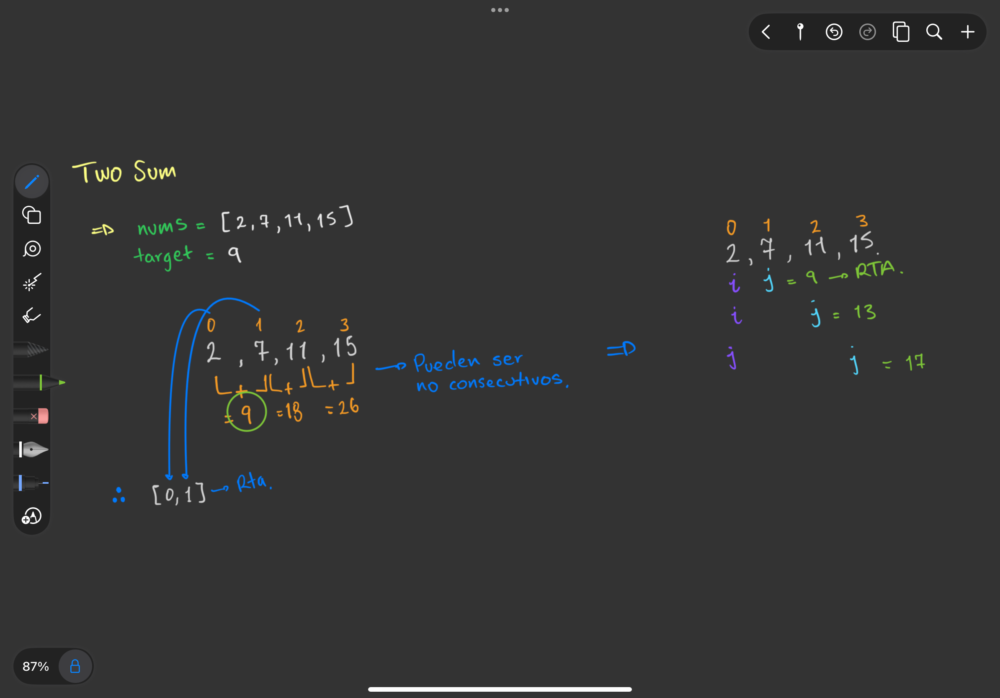

# Two Sum

Este proyecto contiene la solución en **Java** al reto **Two Sum** de [LeetCode](https://leetcode.com/problems/two-sum/).

---

## 📌 Enunciado

Dado un arreglo de enteros `nums` y un número entero `target`, devuelve los **índices de los dos números** que suman el `target`.

- Cada entrada tendrá **exactamente una solución**.
- No puedes usar el mismo elemento dos veces.
- El orden de los índices no importa.

---

## 🧩 Ejemplo

**Input:**
nums = [2, 7, 11, 15], target = 9

**Output:**
[0, 1]

**Porque:** `nums[0] + nums[1] = 2 + 7 = 9`.

---
## ✍️ Explicación Visual

Para entender el problema, hice este apunte a mano:



---

## 🚀 Ejecución

1. Clona este repositorio:
   ```bash
   git clone https://github.com/tu-usuario/TwoSum.git
   
2. Compila el proyecto:
   ```bash
   javac src/*.java

3. Ejecuta el programa:
   ```bash
   java src.Main

---

## ✅ Estado
- Solución con fuerza bruta (doble bucle)
- Optimización con HashMap (pendiente)